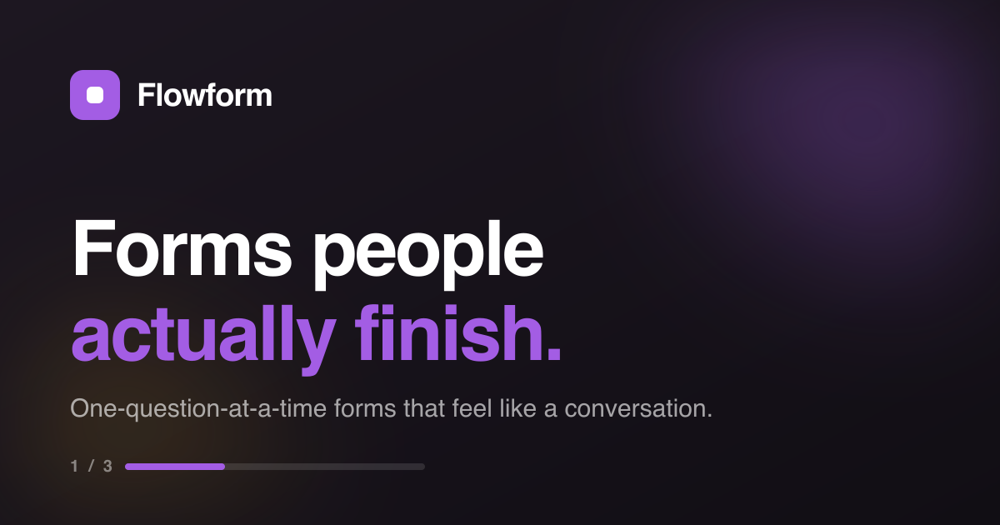

# Flowform

**Forms people actually finish.** A full-stack form builder in the spirit of Typeform: respondents answer one question at a time, like a conversation — which is why they get to the end.



🔗 **Live:** [flowformapp.vercel.app](https://flowformapp.vercel.app) · **Try it without an account:** [interactive demo](https://flowformapp.vercel.app/demo)

> Portfolio project — the product is fully functional end to end, but testimonials and company names on the landing page are illustrative.

## What it does

- **Form builder** — create forms with text, choice, and rating questions in a drag-and-drop editor
- **AI question suggestions** — describe what you want to learn and Claude drafts well-worded questions you can accept or edit
- **Conversational filling experience** — respondents see one question at a time with keyboard navigation (Enter, A–D, 1–0) and a progress bar
- **Live responses** — answers stream into a per-form dashboard as they arrive
- **Interactive demo** — a self-referential Flowform at [`/demo`](https://flowformapp.vercel.app/demo) with a live logic jump: the third question adapts to your previous answer

## Tech stack

| Layer | Choice |
| --- | --- |
| Framework | [TanStack Start](https://tanstack.com/start) (React 19, file-based routing, SSR) |
| Styling | Tailwind CSS 4, shadcn/ui (Radix primitives) |
| Backend | Supabase — Postgres with row-level security, auth |
| AI | Anthropic Claude API via server functions |
| Build & deploy | Vite 7 + Nitro, deployed on Vercel |
| Tooling | Bun, TypeScript, ESLint + Prettier |

## Architecture notes

- **SSR with server functions** — the Claude API is called exclusively from server functions, so the API key never reaches the client.
- **Row-level security** — every table carries RLS policies; a user can only read/write their own forms, questions, and responses. Public form filling is scoped by policy, not by trust in the client.
- **File-based routing** — routes live in `src/routes/`; the landing page, auth, dashboard, builder (`forms.$formId.edit`), responses view, and the public demo are each a route file.
- **Security headers** — CSP, HSTS, and friends are set via Nitro route rules in [vite.config.ts](vite.config.ts).

## Run it locally

```bash
bun install
bun run dev        # http://localhost:8080
```

```bash
bun run typecheck  # tsc --noEmit
bun run lint       # eslint
bun run build      # production build
```

Required env vars: `VITE_SUPABASE_URL` and `VITE_SUPABASE_PUBLISHABLE_KEY` (Supabase project), plus `ANTHROPIC_API_KEY` server-side for the AI question suggestions.
