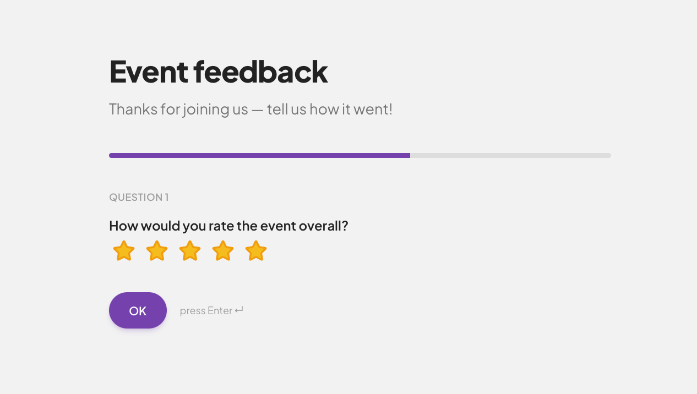
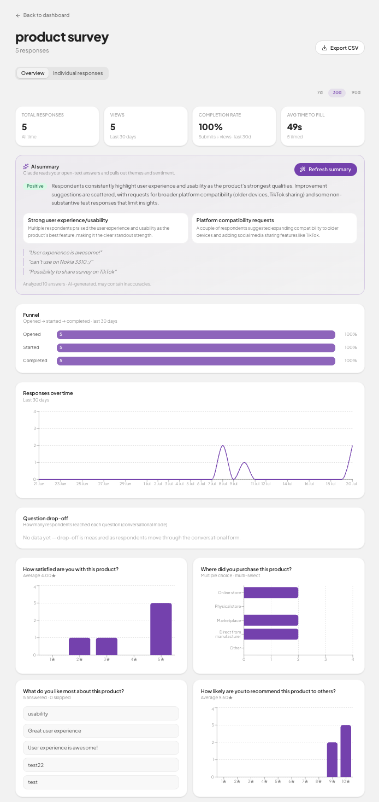

# Flowform

**Forms people actually finish.** A full-stack form builder in the spirit of Typeform: respondents answer one question at a time, like a conversation — which is why they get to the end.


🔗 **Live:** [flowformapp.vercel.app](https://flowformapp.vercel.app) · **Try it without an account:** [interactive demo](https://flowformapp.vercel.app/demo)

> Portfolio project — the product is fully functional end to end, but testimonials and company names on the landing page are illustrative.

<!--
  TODO (author): drop 2–3 real screenshots here for the strongest first impression, e.g.
  
  
  
-->

## What it does

**Building**

- **Drag-and-drop builder** with 7 question types — short & long text, single/multi choice, dropdown, yes/no, NPS, and rating scales
- **AI question suggestions** — describe what you want to learn and Claude drafts well-worded, correctly-typed questions you accept or edit with one click
- **Conditional logic** — forward-only jump rules ("if they answer X, skip to…"), with path-aware validation so a required question a respondent never sees can't block them
- **Templates** to start from, or a blank form; a live preview shows exactly what respondents will see

**Filling**

- **Conversational mode** — one question at a time with a progress bar, full keyboard navigation (Enter, A–D, 0–9), and back-navigation; or a **classic** all-on-one-page mode
- **Drafts persist** locally so a respondent can return and finish, with a guard against double submission

**Measuring**

- **Analytics dashboard** — a real conversion funnel (views → starts → submits), completion rate, average time-to-fill, per-question drop-off, and a response trend over 7/30/90-day windows
- **AI response summaries** — Claude reads open-text answers and pulls out themes, sentiment, and representative quotes
- **Sharing & export** — shareable link, QR code, embed snippet, native share, and CSV export

## Tech stack

| Layer | Choice |
| --- | --- |
| Framework | [TanStack Start](https://tanstack.com/start) — React 19, file-based routing, SSR, server functions |
| Styling | Tailwind CSS 4, shadcn/ui (Radix primitives), dnd-kit for drag-and-drop |
| Backend | Supabase — Postgres with row-level security, auth, and SQL functions (RPCs) |
| AI | Anthropic Claude API, called from server functions |
| Build & deploy | Vite 7 + Nitro, deployed on Vercel |
| Tooling | Bun, TypeScript, Zod, ESLint + Prettier |

## Architecture notes

The interesting decisions, and why:

- **RLS is the security boundary, not the client.** Every table carries row-level-security policies — a user can only read/write their own forms, questions, and responses, and public form-filling is scoped by policy. There is deliberately **no service-role key** in the app: the anon/publishable key plus RLS does all the work, so a leaked client bundle grants nothing.
- **The Claude API key never reaches the client.** AI question suggestions and response summaries run in **server functions** (Vercel serverless via Nitro), reading the key from server-side env only.
- **Atomic editor saves via a Postgres RPC.** Saving the builder is a single transactional `save_form_editor` function that applies reorders, edits, inserts, and deletes in one round-trip — replacing an N+1 write path that could leave a form half-saved. Existing question IDs are preserved, so previously-collected answers (keyed by question ID) stay valid.
- **Analytics over full data.** A `SECURITY DEFINER` RPC computes the funnel/trend/summary server-side across every response (not a client-capped sample), with ownership checked explicitly. The funnel is floored to stay monotonic even when event tracking and response history don't line up.
- **Integrity enforced in the database.** `CHECK` constraints validate the shape of the `options` / `logic` JSON per question type; submissions are rate-limited (per-IP and per-form) and funnel events are de-duplicated and garbage-collected — all in SQL, so the rules hold no matter what hits the API.
- **Auth niceties.** Email verification with branded transactional emails, password-reset / magic-link / email-change flows, a 10-minute idle auto-logout, and the form owner's own test traffic is excluded from analytics so real-respondent metrics stay clean.
- **Security headers** (CSP, HSTS, and friends) are set via Nitro route rules in [vite.config.ts](vite.config.ts).

## Run it locally

```bash
bun install
bun run dev          # http://localhost:8080
```

```bash
bun run typecheck    # tsc --noEmit
bun run lint         # eslint
bun run build        # production build
```

Required env vars: `VITE_SUPABASE_URL` and `VITE_SUPABASE_PUBLISHABLE_KEY` (Supabase project), plus `ANTHROPIC_API_KEY` server-side for the AI features. Database schema lives in [`supabase/migrations/`](supabase/migrations).

---

<sub>Built by [Andrius Kleinas](https://github.com/andriuskleinas) — designed and developed with [Claude Code](https://www.anthropic.com/claude-code) as an AI pair programmer.</sub>
