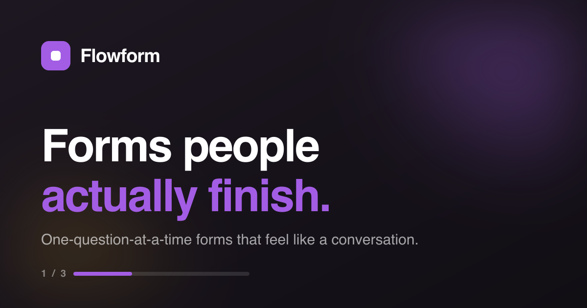
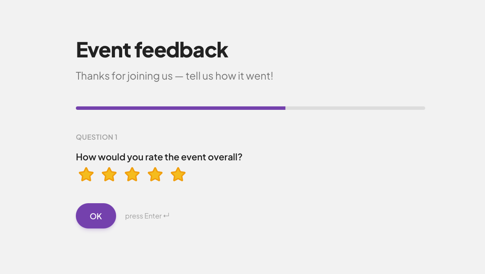
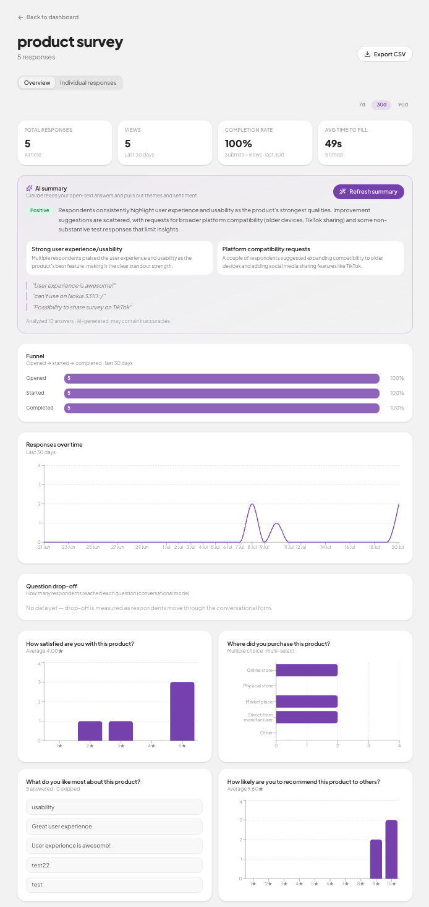
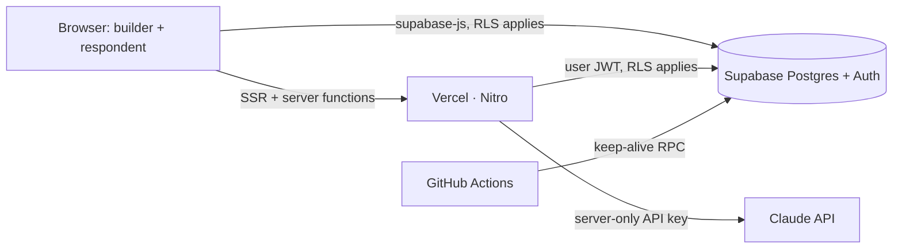

<p align="center">
  
</p>

<p align="center">
  <a href="https://flowformapp.vercel.app"><b>Live app →</b></a>
  ·
  <a href="https://flowformapp.vercel.app/demo">Try the demo</a>
  ·
  <a href="#features">Features</a>
  ·
  <a href="#how-its-built">How it's built</a>
  ·
  <a href="#run-it-yourself">Run it yourself</a>
</p>

<p align="center">
  
  
  
  
  
  
  
  <a href="https://github.com/andriuskleinas/flowform/actions/workflows/ci.yml"></a>
  
</p>

# Flowform

**Forms people actually finish.** A full-stack form builder in the spirit of Typeform: respondents
answer one question at a time, like a conversation, which is why they get to the end. Claude helps
you write the questions and reads the open-text answers for you, and a real conversion funnel shows
exactly where people drop off.

It's a deployed product, built end to end: product design, database security, AI integration,
analytics and auth.

🎥 [Watch a 60-second demo](https://www.loom.com/share/a067acd4829d4d5ba661f69df3316b3b) · no account needed for the [interactive demo](https://flowformapp.vercel.app/demo)

> Portfolio project. The product works end to end, but testimonials and company names on the
> landing page are illustrative.

## Features

| | Feature | What it does |
|---|---|---|
| 🧱 | **Drag-and-drop builder** | 7 question types: short & long text, single/multi choice, dropdown, yes/no, NPS and rating scales. Start from a template or a blank form, with a live preview of what respondents see. |
| ✨ | **AI question suggestions** | Describe what you want to learn and Claude drafts well-worded, correctly typed questions you accept or edit with one click. |
| 🔀 | **Conditional logic** | Forward-only jump rules ("if they answer X, skip to…"), with path-aware validation so a required question a respondent never sees can't block them. |
| 💬 | **Conversational mode** | One question at a time with a progress bar, full keyboard navigation (Enter, A–D, 0–9) and back-navigation. Or a **classic** all-on-one-page mode. |
| 💾 | **Drafts that persist** | Answers are saved locally so a respondent can come back and finish, with a guard against double submission. |
| 📊 | **Analytics dashboard** | A real funnel (opened → started → completed), completion rate, average time-to-fill, per-question drop-off and a response trend over 7/30/90 days. |
| 🧠 | **AI response summaries** | Claude reads open-text answers and pulls out themes, sentiment and representative quotes. |
| 🔗 | **Sharing & export** | Shareable link, QR code, embed snippet, native share and CSV export. |

### Filling a form



### Measuring results



## How it's built


```mermaid
flowchart LR
  U[Browser: builder + respondent] -->|SSR + server functions| V[Vercel · Nitro]
  U -->|supabase-js, RLS applies| S[(Supabase Postgres + Auth)]
  V -->|user JWT, RLS applies| S
  V -->|server-only API key| C[Claude API]
  GH[GitHub Actions] -->|keep-alive RPC| S
```

| Layer | Choices |
|---|---|
| **Frontend** | [TanStack Start](https://tanstack.com/start) (file-based routing, SSR), React 19, Tailwind CSS 4, shadcn/ui on Radix primitives, dnd-kit for drag-and-drop, Recharts for analytics |
| **Backend** | TanStack Start server functions running as Vercel serverless functions via Nitro; Zod validation on AI input and output |
| **Database** | Supabase Postgres with row-level security on every table, 24 versioned SQL migrations, transactional RPCs for editor saves and analytics, `CHECK` constraints on JSON shapes |
| **AI** | Anthropic Claude Opus 5.5 for question suggestions and open-text summaries, called only from server functions, with refusal fallback and Zod-validated output |
| **Auth** | Supabase Auth: email verification with branded emails, password reset, email change, 10-minute idle auto-logout |
| **Automation** | Postgres trigger + `pg_net` posts a Slack alert on each confirmed signup (webhook URL kept in Vault); GitHub Actions runs CI and a keep-alive ping |
| **Hosting** | Vercel, deployed from `main`; Bun for installs and scripts |

### Engineering highlights

- **RLS is the security boundary, not the client.** Every table has row-level-security policies: a
  user can only read and write their own forms, questions and responses, and public form filling is
  scoped by policy. There is deliberately **no service-role key** in the app. The publishable key
  plus RLS does all the work, so a leaked client bundle grants nothing.
- **The Claude API key never reaches the client.** Question suggestions and response summaries run
  in server functions and read the key from server-side env only.
- **Atomic editor saves.** Saving the builder is one transactional `save_form_editor` RPC that
  applies reorders, edits, inserts and deletes in a single round-trip, replacing an N+1 write path
  that could leave a form half-saved. Existing question IDs are preserved, so answers collected
  earlier (keyed by question ID) stay valid.
- **Analytics over all the data.** A `SECURITY DEFINER` RPC computes the funnel, trend and summary
  in Postgres across every response (not a client-capped sample), with ownership checked
  explicitly. The funnel is floored so it stays monotonic even when event tracking and response
  history don't line up.
- **Integrity enforced in the database.** `CHECK` constraints validate the `options` / `logic` JSON
  per question type. Submissions are rate-limited per IP and per form, and funnel events are
  de-duplicated and garbage-collected, all in SQL, so the rules hold no matter what hits the API.
- **Clean metrics.** The form owner's own test traffic is excluded from analytics, so the numbers
  reflect real respondents.
- **Security headers.** CSP `frame-ancestors`, HSTS, `nosniff`, a strict referrer policy and a
  locked-down permissions policy are set through Nitro route rules in [vite.config.ts](vite.config.ts).

## Run it yourself

You need [Bun](https://bun.sh), a [Supabase](https://supabase.com) project and an
[Anthropic API key](https://console.anthropic.com) (only for the AI features).

```bash
git clone https://github.com/andriuskleinas/flowform.git
cd flowform
bun install
cp .env.example .env   # fill in your own keys; never commit .env
bun run dev            # http://localhost:8080
```

Apply the SQL files in [`supabase/migrations/`](supabase/migrations) to your Supabase project, in
order (`supabase db push` with the Supabase CLI does this).

### Checks

```bash
bun run lint         # eslint
bun run typecheck    # tsc --noEmit
bun run build        # production build
```

The same three steps run in [CI](.github/workflows/ci.yml) on every push and pull request.

## Project layout

```
src/routes/                 file-based routes: landing, demo, auth, dashboard, builder, fill, responses
src/components/             conversational form, question renderer, share dialog, app shell
src/components/ui/          shadcn/ui primitives
src/lib/                    server functions (AI suggestions, summaries), form logic, CSV export
src/integrations/supabase/  typed Supabase client
supabase/migrations/        schema, RLS policies, RPCs, constraints, triggers
.github/workflows/          CI and Supabase keep-alive
```

## License

[MIT](LICENSE) © Andrius Kleinas

---

<sub>Built by [Andrius Kleinas](https://github.com/andriuskleinas), designed and developed with [Claude Code](https://www.anthropic.com/claude-code) as an AI pair programmer.</sub>
